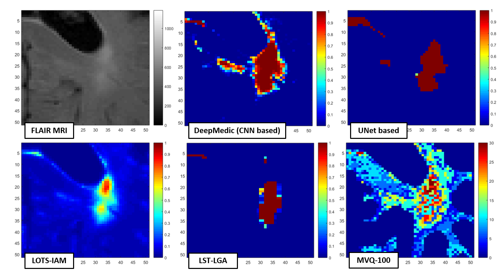
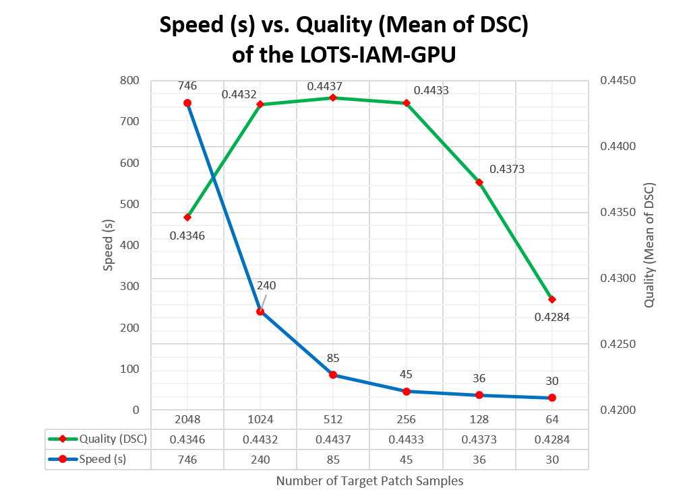

# LOTS-IM-GPU

LOTS-IM-GPU is a fast, fully-automatic, and unsupervised detection method to extract irregular textures of white matter hyperintensities (WMH) on brain FLAIR MRI. Unlike other recently proposed methods for doing WMH segmentation, LOTS-IM-GPU does not need any manual labelling of the WMH. Instead, LOTS-IM-GPU needs brain masks to exclude non-brain tissues (e.g. ICV mask, CSF mask, NAWM mask or cortical mask).

**Notes:** 
1. LOTS-IM-GPU is an abbreviation of Limited One-time Sampling Irregularity Map (LOTS-IM) implemented on GPU.
2. We changed the name of Irregularity Age Map (IAM) to Irregularity Map (IM). However, in this repository, IAM and IM are used interchangeably and there are no differences between the two terms.

### Release Notes
Versioning Name -- dd/mm/yyyy (va.b.c):
 1. 05/09/2019 (v1.0.0):
	 * Moved the pre-processing phase out from the main LOTS-IM function.
	 * Now, the function can do either 2D or 3D computation, set by an input parameter (using `set_3d`).
 3. 05/07/2019 (v0.7.0):
	 * Modification of the original work to extend it to 3D processing with different input.
 4. 31/07/2018 (v0.6.5):
	 * Fix NAWM operation bugs.
	 * NAWM mask now can be used either at pre- or post-processing.
 5. 31/05/2018 (v0.6.0):
	 * Fix header information for the LOTS-IAM-GPU's result.
	 * NAWM and Cortical brain masks are now optional input (will be used if included in the CSV file).
 6. 08/05/2018 (v0.5.3):
     * Updating the initial codes.
     * Making the code more readable.
     * Add lines to cutting off probability mask and deleting intermediary folders. 

### Citations
If you find that this work interesting and helps your work/research, please do cite our publications below.

 1. Rachmadi, M.F., Valdés-Hernández, M.D.C., Li, H., Guerrero, R., Meijboom, R., Wiseman, S., Waldman, A., Zhang, J., Rueckert, D., Wardlaw, J. and Komura, T., 2019. **Limited One-time Sampling Irregularity Map (LOTS-IM) for Automatic Unsupervised Assessment of White Matter Hyperintensities and Multiple Sclerosis Lesions in Structural Brain Magnetic Resonance Images**. BioRxiv, p.334292. doi: [10.1101/334292](https://doi.org/10.1101/334292).
 2. M. F. Rachmadi, M. d. C. Valdés-Hernández and T. Komura, **Automatic Irregular Texture Detection in Brain MRI without Human Supervision**, To be presented in MICCAI 2018, the 21st International Conference on Medical Image Computing and Computer Assisted Intervention. [[PDF-accepted-draft](http://homepages.inf.ed.ac.uk/tkomura/research_dir/miccai2018.pdf)] 
 3. M. F. Rachmadi, M. d. C. Valdés-Hernández and T. Komura, **Voxel-based irregularity age map (IAM) for brain's white matter hyperintensities in MRI**, 2017 International Conference on Advanced Computer Science and Information Systems (ICACSIS), Bali, Indonesia, 2017, pp. 321-326.  doi: [10.1109/ICACSIS.2017.8355053](https://doi.org/10.1109/ICACSIS.2017.8355053).

### Table of Contents
 - [Introduction](https://github.com/febrianrachmadi/lots-iam-gpu#lots-iam-gpu)
	 - [Release Notes](https://github.com/febrianrachmadi/lots-iam-gpu#release-notes)
	 - [Citations](https://github.com/febrianrachmadi/lots-iam-gpu#citations)
 - [1. Installation](https://github.com/febrianrachmadi/lots-iam-gpu#1-installation)
	 - [1.1. Required Libraries](https://github.com/febrianrachmadi/lots-iam-gpu#11-required-libraries)
	 - [1.2. GPU Processing](https://github.com/febrianrachmadi/lots-iam-gpu#12-gpu-processing)
	 - [1.3. Installing Required Libraries](https://github.com/febrianrachmadi/lots-iam-gpu#13-installing-required-libraries)
		 - [1.3.1. Installing on virtual environment of conda (Linux Ubuntu 16.04/Windows) [RECOMMENDED]](https://github.com/febrianrachmadi/lots-iam-gpu#131-installing-on-virtual-environment-of-conda-linux-ubuntu-1604windows-recommended)
		 - [1.3.2. Installing on your local machine (Linux)](https://github.com/febrianrachmadi/lots-iam-gpu#132-installing-on-your-local-machine-linux)
 - [2. Usage](https://github.com/febrianrachmadi/lots-iam-gpu#2-usage)
	 - [2.1. Running the Software](https://github.com/febrianrachmadi/lots-iam-gpu#21-running-the-software)
	 - [2.2. Output](https://github.com/febrianrachmadi/lots-iam-gpu#22-output)
	 - [2.3. Changing Software's Parameters](https://github.com/febrianrachmadi/lots-iam-gpu#23-changing-softwares-parameters)
	 - [2.4. Changing the CSV Input File - List of MRI datasets to be processed](https://github.com/febrianrachmadi/lots-iam-gpu#24-changing-the-csv-input-file---list-of-mri-datasets-to-be-processed)
	 - [2.5. Main Function of the LOTS-IAM-GPU](https://github.com/febrianrachmadi/lots-iam-gpu#25-main-function-of-the-lots-iam-gpu)
 - [3. How the LOTS-IAM-GPU works](https://github.com/febrianrachmadi/lots-iam-gpu#3-how-the-lots-iam-gpu-works)
 - [4. Expected Output](https://github.com/febrianrachmadi/lots-iam-gpu#4-expected-output)
 - [5. Speed vs. Quality](https://github.com/febrianrachmadi/lots-iam-gpu#5-speed-vs-quality)
 - [6. Conclusion](https://github.com/febrianrachmadi/lots-iam-gpu#6-conclusion)
 - [Authors](https://github.com/febrianrachmadi/lots-iam-gpu#authors)
 - [License](https://github.com/febrianrachmadi/lots-iam-gpu#license)
 - [Acknowledgments](https://github.com/febrianrachmadi/lots-iam-gpu#acknowledgments)
 - [References](https://github.com/febrianrachmadi/lots-iam-gpu#references)

## 1. Installation

These instructions will get you a copy of the software up and running on your local machine or virtual environment for development and testing purposes. Please clone/download the project from:
```
https://github.com/febrianrachmadi/lots-iam-gpu
```

### 1.1. Required Libraries

The project is written in Python3. Below is the list of minimum prerequisites for running the project. Please note that versions of prerequisties are listed to inform user of the tested environment.

- Python (3.5/3.6)
- [Matplotlib (2.2.2)](https://matplotlib.org/): Required to save outputs in JPEG files for visualisation.
- [Numba (0.37.0)](https://numba.pydata.org/): Required for GPU parallel computing.
- [OpenCV (3.3.1)](https://docs.opencv.org/3.0-beta/index.html): Required for computer vision operations.
- [scikit-image (0.13.1)](http://scikit-image.org/): Required for computer vision operations.
- [NiBabel (2.2.1)](http://nipy.org/nibabel/): Required for loading and writing NIFTI files.
- [NumPy (1.14.2)](http://www.numpy.org/): General purpose array-processing package.
- [Cuda Toolkit](https://developer.nvidia.com/cuda-downloads): CUDA Toolkit for parallel programming.

### 1.2. GPU Processing

First of all, you should make sure that Nvidia's CUDA Toolkit has been installed in your local machine. Please install [Nvidia's CUDA Toolkit](https://developer.nvidia.com/cuda-toolkit) compatible with your GPU and OS.

### 1.3. Installing Required Libraries

You have two options to install the project on your machine:
1. Installing and running LOTS-IAM-GPU on top of virtual environment (tested on Ubuntu 16.04/Windows) [[Section 1.3.1](https://github.com/febrianrachmadi/lots-iam-gpu#131-installing-on-virtual-environment-of-conda-linux-ubuntu-1604windows-recommended)].
2. Installing and running LOTS-IAM-GPU directly on your local machine (tested on Ubuntu 16.04) [[Section 1.3.2](https://github.com/febrianrachmadi/lots-iam-gpu#132-installing-on-your-local-machine-linux)].

**Note:** Please make sure that Python3 has been installed in your local machine before continuing (recommended).

#### 1.3.1. Installing on virtual environment of conda (Linux Ubuntu 16.04/Windows) [RECOMMENDED]

We provide `.yml` files in [environments](https://github.com/iboele/lots-iam-gpu/tree/master/environments) folder which can be used to activate a virtual environment for running LOTS-IAM-GPU in Ubuntu-16.04/Windows. This is very useful especially if you want to run the software on Windows OS.

Below is list of `.yml` files provided.

1. [IAM_GPU_LINUX_mini](https://github.com/iboele/lots-iam-gpu/blob/master/environments/linux_iam_gpu_env_mini.yml): An environment (for Linux Ubuntu-16.04) which contains minimum requirenments for LOTS-IAM-GPU.
2. [IAM_GPU_LINUX_jynb](https://github.com/iboele/lots-iam-gpu/blob/master/environments/linux_iam_gpu_jynb_env.yml): Similar as Number 1 (for Linux Ubuntu-16.04), plus Jupyter Notebook GUI kernel.
3. [IAM_GPU_WIN](https://github.com/iboele/lots-iam-gpu/blob/master/environments/win_iam_gpu_jynb_env.yml): Similar as Number 1 (for Windows 10), plus Jupyter Notebook GUI kernel.

To use the provided environments, you have to install either Anaconda Navigator or miniconda for `python3`:
1. Use [Anaconda Navigator](https://www.anaconda.com/download/) if you want to have GUI to work with. Please follow [these instructions](https://docs.anaconda.com/anaconda/install/) for detailed installation.
2. Use [miniconda](https://conda.io/miniconda.html) if you do not need GUI (command lines only). Please follow [these instructions](https://conda.io/docs/user-guide/install/index.html) for detailed installation.

**NOTE:** GUI workspace is provided by Jupyter Notebook which can be called by using either *Anaconda Navigator's GUI* or *miniconda's command line* (by calling `jupyter notebook` after importing and activating the virtual environment). 

After installation of Anaconda/miniconda, you now can import the provided environtments by following these instructions:
1. For **Anaconda Navigator**, please follow [these instructions](https://docs.anaconda.com/anaconda/navigator/tutorials/manage-environments#importing-an-environment).
2. For **miniconda**, please follow [these instructions](https://conda.io/docs/user-guide/tasks/manage-environments.html#creating-an-environment-from-an-environment-yml-file). Example:
    ```
    conda env create -f environments/linux_iam_gpu_jynb_env.yml
    ```

After importing the environment file, you should be able to see the imported environment's name (in **Anaconda Navigator**, choose `Home > Applications on` or `Environments` tabs; while in **miniconda**, call `conda env list`). You now should be able to activate/deactivate (i.e. load/unload) the virtual environment by following these instructions:
1. For **Anaconda Navigator**, please follow [these instructions](https://docs.anaconda.com/anaconda/navigator/tutorials/manage-environments#using-an-environment).
2. For **miniconda**, please follow [these instructions](https://conda.io/docs/user-guide/tasks/manage-environments.html#activating-an-environment). Example:
    ```
    source activate IAM_GPU_LINUX_mini
    ```

By activating the provided environment, you should be able to run the project (if only if you have installed [CUDA Toolkit](https://github.com/febrianrachmadi/lots-iam-gpu#gpu-processing) in your machine). To deactivate (i.e. unload) an active environment running on terminal, call `source deactivate`.

If you need more help on Anaconda Navigator or miniconda, please see [**Anaconda Navigator**](https://docs.anaconda.com/anaconda/navigator/) or [**miniconda**](https://conda.io/docs/index.html).

#### 1.3.2. Installing on your local machine (Linux)

If you would like to run the LOTS-IAM-GPU on your machine, you could easily do that by installing all of required libraries on your local machine. If you are not sure how to do it, please follow instructions below.

1. Install `python3` ([instructions](https://askubuntu.com/questions/865554/how-do-i-install-python-3-6-using-apt-get)).
2. Install `pip3` for `python3`:
    ```
    sudo apt-get install python3-setuptools
    sudo easy_install3 pip
    ```
3. Install miniconda for `python3` ([insructions](https://conda.io/docs/user-guide/install/linux.html)) and update it:
    ```
    conda update -n base conda
    ```
4. Install required libraries from `conda`:
    ```
    conda install --file environments/requirements_conda.txt
    ```
5. Install required libraries from `pip3`:
    ```
    pip3 install -r environments/requirements_pip3.txt
    ```

## 2. Usage

### 2.1. Running the Software

**Anaconda Navigator (Jupyter Notebook/GUI):** Please follow instructions below to run the software via Anaconda Navigator.
1. Open `Anaconda Navigator` from `Start` menu (Windows) or `Terminal > $ anaconda-navigator` (Ubuntu-16.04).
2. Activate the virtual environment by choosing `Home > Applications on > IAM_GPU_LINUX_jynb > jupyter notebook > Launch` tabs (Ubuntu-16.04) or `Home > Applications on > IAM_GPU_WIN > jupyter notebook > Launch` tabs (Windows).
3. Go to LOTS-IM-GPU working directory.
4. Open `LOTS_IM_GPU_FUNction_release.ipynb` Jupyter Notebook file.
5. Choose working kernel by choosing `Kernel > Change kernel > IAM_GPU_LINUX_jynb` (only for Linux/Ubuntu-16.04).
6. Run all cells by choosing `Kernel > Restart & Run All`. *Note*: You can run each cell one-by-one by choosing a cell and then click `>| Run` button.
7. The results should be saved in a new folder listed in `output_filedir` variable.
8. Wait until all jobs in all cells are finished.

**Miniconda (command line):** Please follow instructions below to run the software via miniconda/command line.
1. Open `Terminal` (Linux Ubuntu-16.04) or `Anaconda Prompt` from `Start` menu (Windows).
2. Activate the virtual environment by calling `source activate IAM_GPU_LINUX_mini` (Ubuntu-16.04) or `activate IAM_GPU_WIN` (Windows).
3. Go to LOTS-IAM-GPU working directory.
4. Run the software by calling `python lots_im_gpu.py` on the terminal.
5. The results should be saved in a new folder listed in `output_filedir` variable.

**Local Machine (Linux/command line):** Please follow instructions below to run the software via command line (Ubuntu 16.04). Please, make sure that all libraries have been installed.
1. Go to LOTS-IAM-GPU working directory.
2. Run the software by calling `python lots_im_gpu.py` on the terminal.
3. The results should be saved in a new folder listed in `output_filedir` variable.

### 2.2. Output

The software will automatically create a new folder listed in `output_filedir` variable. Some parameters will be concatenated at the end of folder's name to make it unique; where the default setting is following convention of `experiment_name`*_*`number_of_samples`. Inside this folder, each subjects will have its own folder to save results produced by LOTS-IM's method. To change experiment's name and number of samples, please see [Section 2.3. Changing Software's Parameters](https://github.com/febrianrachmadi/lots-iam-gpu#23-changing-softwares-parameters).

Inside the experiment's folder, each patient/MRI data will have its own folder. In default, there are 6 sub-folders which are:
1. **1**: Contains irregularity maps of each slice (normalised to 0-1) generated by using 1x1 patch. Saved in `.mat` format (Matlab).
2. **2**: Contains irregularity maps of each slice (normalised to 0-1) generated by using 2x2 patch. Saved in `.mat` format (Matlab).
3. **4**: Contains irregularity maps of each slice (normalised to 0-1) generated by using 4x4 patch. Saved in `.mat` format (Matlab).
4. **8**: Contains irregularity maps of each slice (normalised to 0-1) generated by using 8x8 patch. Saved in `.mat` format (Matlab).
5. **JPEGs**: Contains two sub-folders:
    * **Patch**: contains visualisation of irregularity maps of each slices in `JPEG` files, and
    * **Combined**: contains visualisation of the final output of LOTS-IM-GPU's computation in `JPEG` files.
6. **IAM_GPU_nifti_python**: Contains 2 NIfTI files (`.nii.gz`):
    * `IAM_GPU.nii.gz`: the original irregularity map values and
    * `IAM_GPU_GloballyNormalised.nii.gz`: **the final irregularity map** (i.e. global normalisation and penalty).

### 2.3. Changing Software's Parameters

In default, there are six parameters that can be easily changed by the user (listed below).

```python
## General output full path (note to user: you can change this variable)
output_filedir = "/mnt/storage/MRI_dataset/LOTS_IM_results_mini"

## Set setting of LOTS-IM's calculation
## Default: True (default) --> 3D LOTS-IM (volume based calculation)
## Otherwise (False): 2D LOTS-IM (slice based calculation)
set_3d = True

## Size of source and target patches.
## Must be in the form of python's list data structure.
## Default: patch_size = [1,2,4,8]
patch_size = [1,2,4,8]

## Weights for age map blending produced by different size of source/target patches
## Must be in the form of python's list data structure.
## Its length must be the same as 'patch_size' variable.
## Default: blending_weights = [0.65,0.2,0.1,0.05]
blending_weights = [0.65,0.2,0.1,0.05]

## Used only for automatic calculation for all number of samples
## NOTE: Smaller number of samples makes computation faster (please refer to the manuscript).
## Samples used for IAM calculation
## Default: num_samples_all = [512]
num_samples_all = [64]
## Uncomment line below and comment line above if you want to run all different number of samples
# num_samples_all = [64, 128, 256, 512, 1024, 2048]

## Weight of distance function to blend maximum difference and average difference between source
## and target patches. Default: alpha=0.5. Input value should be between 0 and 1 (i.e. floating).
alpha = 0.5

## Thresholds the target patches to prevent including patches containing hyper-intensities.
## Default : threshold_patches = None.
## You might want to try: thrsh_patches = 0.05
thrsh_patches = None

## Save JPEG outputs
## Default: save_jpeg = True
save_jpeg = True

## Delete all intermediary files/folders, saving some spaces in the hard disk drive.
## Default: delete_intermediary = True
delete_intermediary = True
```

User can change these parameters via [`lots_im_parameters.py`](https://github.com/febrianrachmadi/lots-iam-gpu/blob/master/lots_im_parameters.py) file or the second active cell in [`LOTS_IM_GPU_FUNction_release.ipynb`](https://github.com/febrianrachmadi/lots-iam-gpu/blob/master/LOTS_IM_GPU_FUNction_release.ipynb) file (Jupyter Notebook user only) before running the software.

**Important notes:** Some more explanations regarding of changeable parameters.
 1. **Parameter `output_filedir`**: Its value should follow this convention: `../output_path`/`name_of_experiment`.
 2.  **Parameter `set_3d`**: Its value controls the setting of LOTS-IM's calculation (i.e., 2D (slice) or 3D (volume)). The default is `True`.
 3. **Parameter `patch_size`**: Its value controls the sizes of source/target patches used in the computation. The default value is a python list `[1,2,3,4]` i.e. translated to `1 x 1`, `2 x 2`, `4 x 4`, and `8 x 8` source/target patches. If user input only one number (e.g. `[2]`), then LOTS-IM-GPU will do computation by using `2 x 2` source/target patch only. **NOTE**:  Feel free to use different number of source/target patches, but other than these four numbers, it is not guaranteed that the software will finish the computation without any trouble.
 4. **Parameter `blending_weights`**: Its value controls blending weights used for blending all irregularity maps produced by different size of source/target patches. The weights must be the form of python's list, summed to 1, and its length must be the same as `patch_size` variable.
 5. **Parameter** `num_samples_all`: A list of numbers used for randomly sampling target patches to be used in the calculation of LOTS-IM-GPU. Some fixed and limited numbers of target patches are available to be used by user, which are 64, 128, 256, 512, 1024, 2048. These numbers are chosen to make GPU's memory management easier. **Some important notes regarding of this parameter are**:
    * Smaller number will make computation faster.
    * Input the numbers as a list to automatically produce irregularity maps from all different numbers of target patches. The software will automatically create different output folders.
    * For this version, only 64, 128, 256, 512, 1024, and 2048 can be used as input numbers (error will be raised if other numbers are used).
 6. **Parameter `alpha`**: Weight of distance function to blend maximum difference and average difference between source and target patches. Default: `alpha = 0.5`. Input value should be between 0 and 1 (i.e. floating points). The current distance function being used is: `d = (alpha . |max(s - t)|) + ((1 - alpha) . |mean(s - t)|)` where `d` is distance value, `s` is source patch, and `t` is target patch. 
 7. **Parameter `thrsh_patches`**: Thresholds the target patches during extraction phase to prevent the inclusions of patches containing prior knowledge of WMH (early automatic detection/estimation using confidence interval (CI) of 95%). Note, this only works for 3D LOTS-IM.
 8. **Parameter `save_jpeg`**: Input `False` if you do not want to save JPEG visualisation files.
 9. **Parameter `delete_intermediary`**: Input `True` if you want to delete all intermediary files, which can save some spaces in the hard disk drive.

### 2.4. Changing the CSV Input File - List of MRI datasets to be processed

A CSV file is used to list all input data to be processed by LOTS-IM-GPU method. The default name of the CSV file is [`IAM_GPU_pipeline_test_v2.csv`](https://github.com/febrianrachmadi/lots-iam-gpu/blob/master/IAM_GPU_pipeline_test_v2.csv). Feel free to edit or make a new CSV input file. 

**IMPORTANT NOTE IN LOTS-IM v1.0.0:** 
1. In the newest version of LOTS-IM, MRI scans and pre-processing are read and performed outside the main function of LOTS-IM to give the user higher control of how the MRI data are pre-processed. In our study, we used used 1.5T T2-FLAIR MRI. We believe that pre-processing will be different if different machines are used.
2. The main function of LOTS-IM (i.e., `lots_im_function_compute`) retrieve 3D Numpy array as its input.

| Path to MRI's folder | Names of MRI data | Path to FLAIR NIfTI files | Path to ICV NIfTI files | Path to CSF NIfTI files | Path to NAWM NIfTI files (optional) | Path to Cortical NIfTI files (optional) |
|:--------------------:|:-------------:|:--------------------:|:------------------:|:------------------:|:-------------------:|:-------------------:|
| /dir/.../MRIdatabase/ | MRI001        | /dir/.../MRIdatabase/MRI001/FLAIR.nii.gz | /dir/.../MRIdatabase/MRI001/ICV.nii.gz | /dir/.../MRIdatabase/MRI001/CSF.nii.gz | /dir/.../MRIdatabase/MRI001/NAWM.nii.gz | /dir/.../MRIdatabase/MRI001/Cortex.nii.gz |
| /dir/.../MRIdatabase/ | MRI001        | /dir/.../MRIdatabase/MRI002/FLAIR.nii.gz | /dir/.../MRIdatabase/MRI002/ICV.nii.gz | /dir/.../MRIdatabase/MRI002/CSF.nii.gz | /dir/.../MRIdatabase/MRI002/NAWM.nii.gz | /dir/.../MRIdatabase/MRI002/Cortex.nii.gz |
| ...    | ...        | ... | ... | ... | ... | ... |
| /dir/.../MRIdatabase/ | MRInnn        | /dir/.../MRIdatabase/MRInnn/FLAIR.nii.gz | /dir/.../MRIdatabase/MRInnn/ICV.nii.gz | /dir/.../MRIdatabase/MRInnn/CSF.nii.gz | /dir/.../MRIdatabase/MRInnn/NAWM.nii.gz | /dir/.../MRIdatabase/MRInnn/Cortex.nii.gz |


### 2.5. Main Function of the LOTS-IM-GPU

The main function of the LOTS-IM-GPU is located in [`LOTS_IM_GPU_FUNction.py`](https://github.com/febrianrachmadi/lots-iam-gpu/blob/master/LOTS_IM_GPU_FUNction.py), which is named `lots_im_function_compute`. You can call function's `help` by calling `help(lots_im_function_compute)` inside Python kernel.

### 3. How the LOTS-IM-GPU works

The key idea of the LOTS-IM is treating hyperintensities of the FLAIR MRI as irregular textures as in [[1]](https://github.com/febrianrachmadi/lots-iam-gpu#references). To do this, there are at least four steps to complete the LOTS-IM's computation which are listed below.

 1. Data preparation: Masking out unneeded area of the brain (i.e. pre-processing).
 2. Patch generation: Generting source patches and target patches.
 3. Irregularity value calculation: Calculating irregularity value by using a distance function.
 4. Final irregularity map generation: Calculating penalty and global normalisation.

To understand LOTS-IM's computation, one should understand two different types of patches, which are *source patches* and *target patches*. *Source patches* are the non-overlapping grid-patches of brain tissues (i.e. inside intracranial volume (ICV) and outside cerebrospinal fluid (CSF) brain masks). Whereas, *target patches* are randomly sampled patches from all possible overlapping patches which come from the same slice (also need to be inside ICV mask and outside CSF mask). *Irregularity value* is then calculated between ***all** source patches* and ***some of the** target patches* by using a distance function to create *irregularity maps* of all slices of MR image. 

Because of the nature of LOTS-IM's computation, hundreds (if not thousands) of source patches need to be compared/calculated with thousands of target patches. Thus, implementation of LOTS-IM on GPU is needed to speed up its computation. Based on our experiments, implementation of LOTS-IM on GPU speeds up the computation by over 13.5 times without having any drawback on the quality of the results. The summary and flow of the LOTS-IM-GPU's computation can be seen in Figure 1 below. If you are interested to learn more about the LOTS-IM-GPU, feel free to read extended explanation and experiments of the method in our [publications](https://github.com/febrianrachmadi/lots-iam-gpu#citations).


Figure 1: Flow of one slice of MRI data processed by LOTS-IM-GPU.

### 4. Expected Output

The biggest different between LOTS-IM-GPU and other WMH segmentation methods are their respective results. Most of WMH segmentation methods produce probability values of all voxels as white matter hyperintensities (WMH) (i.e. a voxel has a high probability value if the chance of it as WMH is high). On other hand, LOTS-IM-GPU produces irregularity values of all voxels which explain each voxel's irregularity (i.e. level of damage of each voxel) compare to other voxels in the brain. Thus, LOTS-IM-GPU produces richer information of WMH than other WMH segmentation methods, especially when many WMH segmentation methods cut off the probability values to become binary segmentation. Visualisation of the LOTS-IM-GPU and other WMH segmentation methods can be seen in Figure 2 below.


Figure 2: Visualisation of probabilistic values of WMH produced by LOTS-IM compare to other methods, which are the [DeepMedic](https://github.com/Kamnitsask/deepmedic), U-Net based deep neural networks, [LST-LGA](http://www.applied-statistics.de/lst.html), and minimum variance quantization with 100 levels (MVQ-100). The DeepMedic and U-Net are supervised deep neural networks methods whereas LOTS-IM(-GPU), LST-LGA, and MVQ-100 are unsupervised methods.

As showed in Figure 2, irregularity map (IM) has an important characteristic where it retains more texture information than probability map or binary mask of WMH. This is very helpful for simulating the regression and progression of WMH (see figure below). Please see the paper for full explanation of the proposed algorithm and discussion at [here](https://doi.org/10.1007/978-3-030-00320-3_11).


### 5. Speed vs. Quality

The code is implemented so that any user can change the number of target patch samples used for irregularity map calculation in the LOTS-IM-GPU. The relation between number of target patch samples and speed/quality of the results is depicted in the Figure 3 below. The means of DSC depicted below were produced on 60 MRI scans (manually labelled by expert) from ADNI database.


Figure 3: Speed  versus quality of different number of target patch samples used in the LOTS-IM-GPU.

### 6. Conclusion

In recent years, the development of unsupervised detection methods of hyperintensities in brain MRI is slower than the supervised methods, especially after the usage of *state-of-the-art* deep neural networks methods in biomedical image processing and analysis. However, we believe that unsupervised methods have its own place in biomedical image analysis because its independency. Whilst  supervised methods depend on the quality and amount of expert labelled data similar to the sample to be used, LOTS-IM-GPU and other unuspervised methods do not need training and is independent from imaging protocols and sample characteristics.

By making the LOTS-IM-GPU publicly available, we hope that it can be used as **a new baseline method of unsupervised WMH segmentation**. We will keep updating the LOTS-IM-GPU in the next future as well as making it more modular so that different pre-/post-processing processes could be easily incorporated by users. Please, feel free to ask any question or give feedback to improve LOTS-IM-GPU's usage.

Best wishes,

Febrian Rachmadi

## Authors

* Febrian Rachmadi - Main Author of the LOTS-IM.
* Melvin Gelbard - Modified 2D LOTS-IM to 3D LOTS-IM.

## License

This project is licensed under the BSD 3-Clause License - see the [LICENSE](LICENSE) file for details.

## Acknowledgments

* [School of Informatics, The University of Edinburgh](https://www.ed.ac.uk/informatics)
* [Centre for Clinical Brain Sciences, The University of Edinburgh](https://www.ed.ac.uk/clinical-brain-sciences)
* [LPDP | Indonesia Endowment Fund for Education - Minsitry of Finance, Republic of Indonesia](https://www.lpdp.kemenkeu.go.id/)

Funds from Indonesia Endowment Fund for Education (LPDP) of Ministry of Finance, Republic of Indonesia and Row Fogo Charitable Trust (Grant No. BRO-D.FID3668413) (MCVH) are gratefully acknowledged.

## References

 1. Bellini, R., Kleiman, Y., & Cohen-Or, D. (2016). Time-varying weathering in texture space. _ACM Transactions on Graphics (TOG)_, _35_(4), 141.
 
