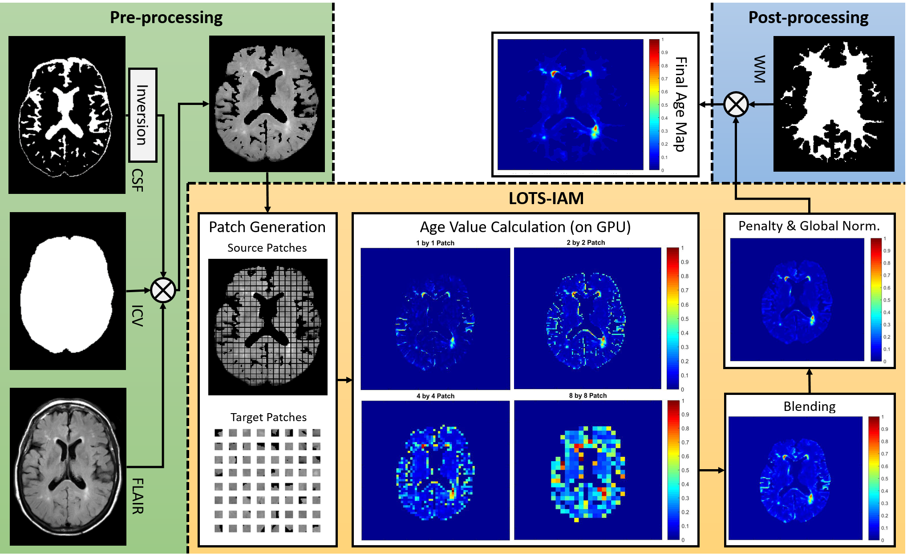

# LOTS-IAM-GPU
LOTS-IAM-GPU is a fast and fully-automatic unsupervised detection of irregular textures of white matter hyperintensities (i.e. WMH) on brain MRI. LOTS-IAM-GPU is an abbreviation of Limited One-time Sampling Irregularity Age Map (LOTS-IAM) on GPU.

## 1. Installation

These instructions will get you a copy of the project up and running on your local machine for development and testing purposes. Please clone/download the project from:
```
https://github.com/febrianrachmadi/lots-iam-gpu
```

### 1.1. Required Libraries

The project is written in Python3. Below is the list of minimum prerequisites for running the project. Please note that versions of prerequisties are listed to inform user of the tested environment.

- Python (3.5/3.6)
- [Matplotlib (2.2.2)](https://matplotlib.org/): Required to save outputs in JPEG files for visualisation.
- [Numba (0.37.0)](https://numba.pydata.org/): Required for GPU parallel computing.
- [OpenCV (3.3.1)](https://docs.opencv.org/3.0-beta/index.html): Required for computer vision operations.
- [scikit-image (0.13.1)](http://scikit-image.org/): Required for computer vision operations.
- [NiBabel (2.2.1)](http://nipy.org/nibabel/): Required for loading and writing NIFTI files.
- [NumPy (1.14.2)](http://www.numpy.org/): General purpose array-processing package.
- [Cuda Toolkit](https://developer.nvidia.com/cuda-downloads): CUDA Toolkit for parallel programming.

### 1.2. GPU Processing

First of all, you should make sure that Nvidia's CUDA Toolkit has been installed in your local machine. Please install [Nvidia's CUDA Toolkit](https://developer.nvidia.com/cuda-toolkit) that compatible with your GPU and OS.

### 1.3. Installing Required Libraries

You have two options to install the project on your machine:
1. Installing and running the LOTS-IAM-GPU on top of virtual environment (works for Linux/Windows) [[see Section 1.3.1](https://github.com/febrianrachmadi/lots-iam-gpu/blob/master/README.md#131-installing-on-virtual-environment-of-conda-linuxwindows-recommended)].
2. Installing and running the LOTS-IAM-GPU directly on your local machine (tested on Linux 16.04) [[see Section 1.3.2](https://github.com/febrianrachmadi/lots-iam-gpu/blob/master/README.md#132-installing-on-your-local-machine-linux)].

**Note:** Please make sure that Python3 has been installed in your local machine before continuing (recommended).

#### 1.3.1. Installing on virtual environment of conda (Linux/Windows) [RECOMMENDED]

We provide `.yml` files in [environments](https://github.com/iboele/lots-iam-gpu/tree/master/environments) folder which can be used to activate a virtual environment for running LOTS-IAM-GPU in Linux/Windows. This is very useful especially if you want to run the software on Windows OS.

Below is list of `.yml` files provided.

1. [IAM_GPU_LINUX_mini](https://github.com/iboele/lots-iam-gpu/blob/master/environments/linux_iam_gpu_env_mini.yml): An environment (Linux) which contains minimum requirenments for LOTS-IAM-GPU.
2. [IAM_GPU_LINUX_jynb](https://github.com/iboele/lots-iam-gpu/blob/master/environments/linux_iam_gpu_jynb_env.yml): Similar as Number 1 (Linux), plus Jupyter Notebook GUI kernel.
3. [IAM_GPU_WIN](https://github.com/iboele/lots-iam-gpu/blob/master/environments/win_iam_gpu_jynb_env.yml): Similar as Number 1 (for Windows), plus Jupyter Notebook GUI kernel.

To use the provided environments, you have to install either Anaconda Navigator or miniconda for `python3`:
1. Use [Anaconda Navigator](https://www.anaconda.com/download/) if you want to have GUI to work with. Please follow [these instructions](https://docs.anaconda.com/anaconda/install/) for detailed installation.
2. Use [miniconda](https://conda.io/miniconda.html) if you do not need GUI (command lines only). Please follow [these instructions](https://conda.io/docs/user-guide/install/index.html) for detailed installation.

**NOTE:** GUI workspace is provided by Jupyter Notebook which can be called by using either *Anaconda Navigator's GUI* or *miniconda's command line* (by calling `jupyter notebook` after importing and activating the virtual environment). 

After installation of Anaconda/miniconda, you now can import the provided environtments by following these instructions:
1. For **Anaconda Navigator**, please follow [these instructions](https://docs.anaconda.com/anaconda/navigator/tutorials/manage-environments#importing-an-environment).
2. For **miniconda**, please follow [these instructions](https://conda.io/docs/user-guide/tasks/manage-environments.html#creating-an-environment-from-an-environment-yml-file). Example: `conda env create -f environments/linux_iam_gpu_jynb_env.yml`.

After importing the environment file, you should be able to see the imported environment's name (in **Anaconda Navigator**, choose `Home > Applications on` or `Environments` tabs; while in **miniconda**, call `conda env list`). You now should be able to activate/deactivate (i.e. load/unload) the virtual environment by following these instructions:
1. For **Anaconda Navigator**, please follow [these instructions](https://docs.anaconda.com/anaconda/navigator/tutorials/manage-environments#using-an-environment).
2. For **miniconda**, please follow [these instructions](https://conda.io/docs/user-guide/tasks/manage-environments.html#activating-an-environment). Example: `source activate IAM_GPU_LINUX_mini`.

By activating the provided environment, you should be able to run the project (if only if you have installed [CUDA Toolkit](https://github.com/febrianrachmadi/lots-iam-gpu/blob/master/README.md#gpu-processing) in your machine). To deactivate (i.e. unload) an active environment running on terminal, call `source deactivate`.

If you need more help on Anaconda Navigator or miniconda, please see [**Anaconda Navigator**](https://docs.anaconda.com/anaconda/navigator/) or [**miniconda**](https://conda.io/docs/index.html).

#### 1.3.2. Installing on your local machine (Linux)

If you would like to run the LOTS-IAM-GPU on your machine, you could easily do that by installing all of required libraries on your local machine. If you are not sure how to do it, please follow instructions below.

1. Install `python3` ([instructions](https://askubuntu.com/questions/865554/how-do-i-install-python-3-6-using-apt-get)).
2. Install `pip3` for `python3`:
    ```
    sudo apt-get install python3-setuptools
    sudo easy_install3 pip
    ```
3. Install miniconda for `python3` ([insructions](https://conda.io/docs/user-guide/install/linux.html)) and update it:
    ```
    conda update -n base conda
    ```
4. Install required libraries from `conda`:
    ```
    conda install --file environments/requirements_conda.txt
    ```
5. Install required libraries from `pip3`:
    ```
    pip3 install -r environments/requirements_pip3.txt
    ```

## 2. Usage

### 2.1. Running the Software

**Anaconda Navigator (Jupyter Notebook/GUI):** Please follow instructions below to run the software via Anaconda Navigator.
1. Open Anaconda Navigator (Linux/Windows).
2. Activate the virtual environment by choosing `Home > Applications on > IAM_GPU_LINUX_jynb > jupyter notebook > Launch` tabs.
3. Go to LOTS-IAM-GPU working directory.
4. Open `LOTS_IAM_GPU_release.ipynb` Jupyter Notebook file.
5. Choose working kernel by choosing `Kernel > Change kernel > IAM_GPU_LINUX_jynb`.
6. Run all cells by choosing `Kernel > Restart & Run All`. *Note*: You can run each cell one-by-one by choosing a cell and then click `>| Run` button.
7. Wait until all jobs in all cells are finished.
8. The results should be saved in a new folder named `results` inside the LOTS-IAM-GPU working folder.

**Miniconda (command line):** Please follow instructions below to run the software via miniconda/command line.
1. Open Terminal (Linux) or Anaconda Prompt (Windows).
2. Activate the virtual environment by calling `source activate IAM_GPU_LINUX_mini` (Linux) or `activate IAM_GPU_WIN` (Windows).
3. Go to LOTS-IAM-GPU working directory.
4. Run the software by calling `python iam_lots_gpu.py` on the terminal.
5. The results should be saved in a new folder named `results` inside the LOTS-IAM-GPU working folder.

**Local Machine (Linux/command line):** Please follow instructions below to run the software via Linux/command line.
1. Go to LOTS-IAM-GPU working directory.
2. Run the software by calling `python iam_lots_gpu.py` on the terminal.
3. The results should be saved in a new folder named `results` inside the LOTS-IAM-GPU working folder.

### 2.2. Expected Output

The software will automatically create a new folder named `results` in the working folder (default). Inside this folder, each experiment will have its own folder to save results produced by LOTS-IAM-GPU's method. The experiment output folder name's follows convention of `experiment_name`*_*`number_of_samples`. To change experiment's name and number of samples, please see [Section 2.3. Changing Software's Parameters](https://github.com/febrianrachmadi/lots-iam-gpu/blob/master/README.md#23-changing-softwares-parameters).

Inside the experiment's folder, each patient/MRI data will have its own folder. In default, there are 6 sub-folders which are:
1. **1**: Contains age maps of each slice (normalised to 0-1) generated by using 1x1 patch. Saved in `.mat` format (Matlab).
2. **2**: Contains age maps of each slice (normalised to 0-1) generated by using 2x2 patch. Saved in `.mat` format (Matlab).
3. **4**: Contains age maps of each slice (normalised to 0-1) generated by using 4x4 patch. Saved in `.mat` format (Matlab).
4. **8**: Contains age maps of each slice (normalised to 0-1) generated by using 8x8 patch. Saved in `.mat` format (Matlab).
5. **IAM_combined_python**: Contains two sub-folders:
    * **Patch**: contains visualisation of age maps of each slices in `JPEG` files, and
    * **Combined**: contains visualisation of the final output of LOTS-IAM-GPU's computation in `JPEG` files and a `.mat` file.
6. **IAM_GPU_nifti_python**: Contains three NIfTI files (`.nii.gz`):
    * `IAM_GPU_COMBINED.nii.gz`: the original age map values, 
    * `IAM_GPU_GN.nii.gz`: the final age map values (i.e. global normalisation and penalty), and the
    * `IAM_GPU_GN_postprocessed.nii.gz`: the final age map values plus post-processing.

### 2.3. Changing Software's Parameters

In default, there are five paramaters that can be easily changed by the user (listed below).

```python
## General output full path (note to user: you can change this variable)
output_filedir = "results/IAM_GPU_pipeline_test"

## Name of csv file (note to user: you can change this variable)
csv_filename = "IAM_GPU_pipeline_test_v2.csv"

# Save JPEG outputs
save_jpeg = True

## Size of source and target patches
## Default: patch_size = [1,2,4,8]
patch_size = [1,2,4,8]

## Number of samples used for LOTS-IAM calculation 
## NOTE: Smaller number of samples makes computation faster (please refer to the manuscript).
## Default: num_samples_all = [512]
num_samples_all = [64]
## Uncomment line below and comment line above if you want to run all different number of samples 
# num_samples_all = [64, 128, 256, 512, 1024, 2048]
```

User can change these parameters via [`iam_params.py`](https://github.com/febrianrachmadi/lots-iam-gpu/blob/master/iam_params.py) file or the second active cell in [`LOTS_IAM_GPU_release.ipynb`](https://github.com/febrianrachmadi/lots-iam-gpu/blob/master/LOTS_IAM_GPU_release.ipynb) file (Jupyter Notebook user only) before running the software.

**Important notes:** Some more explanations regarding of changeable parameters.
1. The parameter of `output_filedir` should follow this convention: `output_path`/`name_of_experiment`.
2. The `csv_filename` parameter should refer to a CSV file which contains a list of MRI datasets that will be processed by the LOTS-IAM-GPU method. Please refer to [Section 2.4](https://github.com/febrianrachmadi/lots-iam-gpu/blob/master/README.md#24-changing-the-csv-input-file---list-of-mri-datasets-to-be-processed) for more detailed explanation.
3. Change the value of `save_jpeg` parameter to `False` if you do not want to save JPEG visualisation files.

### 2.4. Changing the CSV Input File - List of MRI datasets to be processed

A CSV file is used to list all input data to be processed by LOTS-IAM-GPU method. The default name of the CSV file is [`IAM_GPU_pipeline_test_v2.csv`](https://github.com/febrianrachmadi/lots-iam-gpu/blob/master/IAM_GPU_pipeline_test_v2.csv). Feel free to edit or make a new CSV input file as long as following the convention below. If you make a new CSV input file, do not forget to change software's input parameters (see [Section 2.3](https://github.com/febrianrachmadi/lots-iam-gpu/blob/master/README.md#23-changing-softwares-parameters)). ***Note:** You do not have to include the first line of example below ([please see the actual example of the CSV file](https://github.com/febrianrachmadi/lots-iam-gpu/blob/master/IAM_GPU_pipeline_test_v2.csv)).*

| Path to MRI's folder | MRI data name | Path to FLAIR.nii.gz | Path to ICV.nii.gz | Path to CSF.nii.gz | Path to NAWM.nii.gz |
|:--------------------:|:-------------:|:--------------------:|:------------------:|:------------------:|:-------------------:|
| /dir/.../MRIdatabase/ | MRI001        | /dir/.../MRIdatabase/MRI001/FLAIR.nii.gz | /dir/.../MRIdatabase/MRI001/ICV.nii.gz | /dir/.../MRIdatabase/MRI001/CSF.nii.gz | /dir/.../MRIdatabase/MRI001/NAWM.nii.gz |
| /dir/.../MRIdatabase/ | MRI001        | /dir/.../MRIdatabase/MRI002/FLAIR.nii.gz | /dir/.../MRIdatabase/MRI002/ICV.nii.gz | /dir/.../MRIdatabase/MRI002/CSF.nii.gz | /dir/.../MRIdatabase/MRI002/NAWM.nii.gz |
| ...    | ...        | ... | ... | ... | ... |
| /dir/.../MRIdatabase/ | MRInnn        | /dir/.../MRIdatabase/MRInnn/FLAIR.nii.gz | /dir/.../MRIdatabase/MRInnn/ICV.nii.gz | /dir/.../MRIdatabase/MRInnn/CSF.nii.gz | /dir/.../MRIdatabase/MRInnn/NAWM.nii.gz |

### 3. How the LOTS-IAM-GPU works


Figure 1: Flow of one slice of MRI data processed by LOTS-IAM-GPU.

### 4. Expected Performance

### 5. License

This project is licensed under the BSD 3-Clause License - see the [LICENSE](LICENSE) file for details.

## Authors

* febrianrachmadi

## Acknowledgments

* [School of Informatics, The University of Edinburgh](https://www.ed.ac.uk/informatics)
* [Centre for Clinical Brain Sciences, The University of Edinburgh](https://www.ed.ac.uk/clinical-brain-sciences)
* [LPDP | Indonesia Endowment Fund for Education - Minsitry of Finance, Republic of Indonesia](https://www.lpdp.kemenkeu.go.id/)
